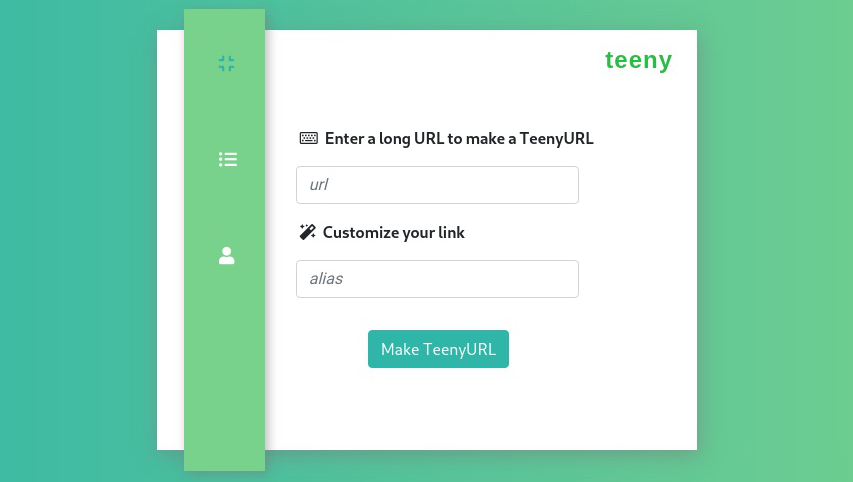
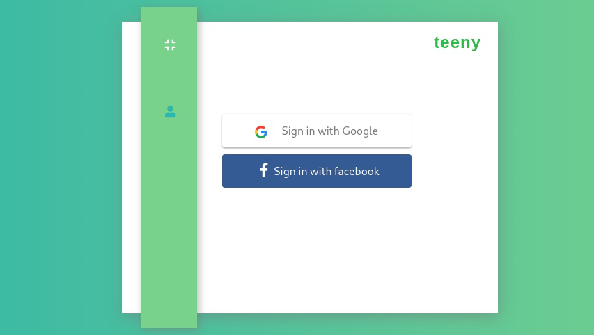
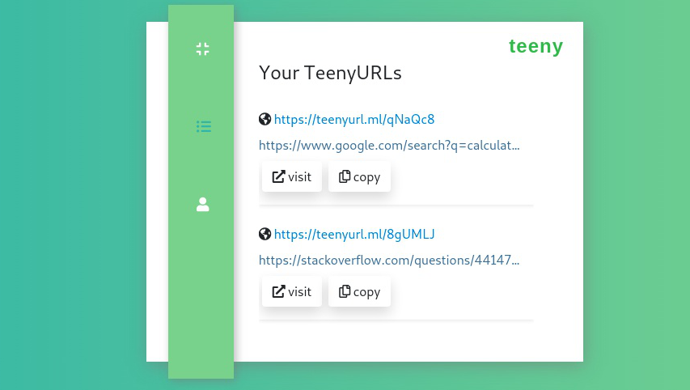
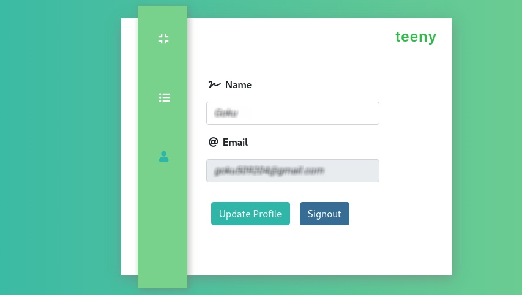

# TeenyURL
A URL shortener website with fastAPI and ReactTS

<div>
  &nbsp; &nbsp;  &nbsp;&nbsp;&nbsp;
</div>

<div>
<h3>Home</h3>

<h3>SignIn</h3>

<h3>Urls</h3>

<h3>Profile</h3>

</div>

## Run the project

### clone repo
```
git clone https://github.com/ajthr/TeenyURL.git
```

### build and run the project
```
docker-compose up --build
```
353

Three things to note here

the variable should be prefixed with REACT_APP_

eg: REACT_APP_WEBSITE_NAME=hello

You need to restart the server to reflect the changes.

Make sure you have the .env file in your root folder(same place where you have your package.json) and NOT in your src folder.

After that you can access the variable like this process.env.REACT_APP_SOME_VARIABLE

Additional tips

No need to wrap your variable value in single or double quotes.
Do not put semicolon ; or comma , at the end of each line.

===================
Nginx port should match docker should match config and env